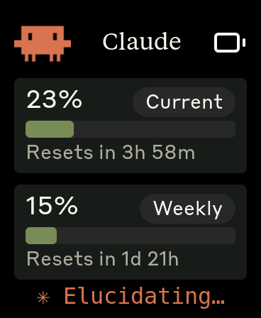
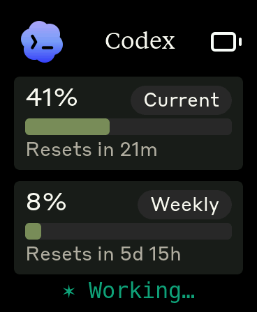
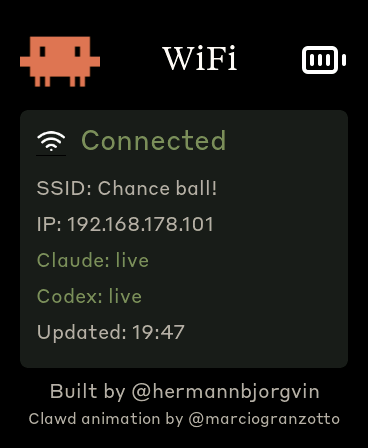

# Clawdmeter

A small ESP32 dashboard I made for my desk to keep an eye on my Claude Code (and Codex) usage at a glance.

It runs on a [Waveshare ESP32-S3-Touch-AMOLED-2.16](https://www.waveshare.com/esp32-s3-touch-amoled-2.16.htm?&aff_id=149786) plus a few other boards (see [Hardware](#hardware)). The device connects to your WiFi network and fetches usage data **directly** from the Anthropic and Codex APIs over TLS, refreshing roughly every 60 seconds. The host runs a small **token broker** that hands the device its API credentials on first boot and whenever a provider returns 401 — otherwise the laptop can be off. The splash screen plays pixel-art Clawd animations that get busier as your usage rate climbs.

|              Usage meter              |              Clawd animation screen              |
| :-----------------------------------: | :----------------------------------------------: |
|  |  |

The Clawd animations come from the [clawd-tank](https://github.com/marciogranzotto/clawd-tank) SVG set by [@marciogranzotto](https://github.com/marciogranzotto) (MIT). A 4-stage pipeline under `tools/svg_pipeline/` renders and converts them to the C arrays the firmware compiles in.

## Screens

The device boots into the splash and stays there until you press the middle (PWR) button, which cycles through the usage screens — Claude, then Codex — and WiFi. Tap the screen anywhere to flip back to the splash; tap again to dismiss it.

|              Splash               |              Claude             |              Codex              |              WiFi               |
| :-------------------------------: | :-----------------------------: | :-----------------------------: | :-----------------------------: |
|  |  |  |  |
|   Splash; touch-toggle anytime    | Claude session & weekly utilization | Codex session & weekly utilization | Connection diagnostics (SSID / IP / RSSI / data age) |

While the splash is up, the middle button cycles animations instead of screens. The firmware also auto-rotates every 20 s within the current usage-rate group, so a long stretch on the splash isn't just one Clawd on loop.

## Hardware

Boards supported out of the box:

- [Waveshare ESP32-S3-Touch-AMOLED-2.16](https://www.waveshare.com/esp32-s3-touch-amoled-2.16.htm?&aff_id=149786)
- [Waveshare ESP32-C6-Touch-AMOLED-2.16](https://www.waveshare.com/esp32-c6-touch-amoled-2.16.htm?&aff_id=149786) 
- [Waveshare ESP32-S3-Touch-AMOLED-1.8](https://www.waveshare.com/esp32-s3-touch-amoled-1.8.htm?&aff_id=149786)

> Please check if a pull request exists for your alternative hardware port before opening a new one, providing QA feedback and testing on the same hardware is more valuable than duplicate pull requests.

**Porting to another board:** the firmware is a thin HAL with per-board folders under `firmware/src/boards/`. Drop in a new folder and a new PlatformIO env — `main.cpp`, `ui.cpp`, and `splash.cpp` never need to change. See [`docs/porting/adding-a-board.md`](docs/porting/adding-a-board.md) for the walk-through and [`docs/porting/hal-contract.md`](docs/porting/hal-contract.md) for the interfaces a port must implement.

## Prerequisites

- Linux (tested on Ubuntu) or macOS
- [PlatformIO CLI](https://docs.platformio.org/en/latest/core/installation/index.html)
- `python3` (the broker is stdlib-only; the installer just creates a venv)
- Claude Code with an active subscription (and/or the Codex CLI signed in, if you want the Codex screen)
- The device and the host machine must be on the same WiFi network

## macOS installation

The macOS host pieces — Python daemon, LaunchAgent, and flash helper — were ported by [Chris Davidson (@lorddavidson)](https://github.com/lorddavidson). Thanks Chris!

### Configure WiFi credentials

Before flashing, copy `firmware/src/net_config.example.h` to `firmware/src/net_config.h` and fill in your network details:

```c
#define WIFI_SSID      "YourNetwork"
#define WIFI_PASSWORD  "YourPassword"
#define DAEMON_HOST    "my-macbook.local"   // your machine's mDNS hostname
#define DAEMON_PORT    8080
#define BROKER_KEY     "a-long-random-secret"  // must match CLAWDMETER_BROKER_KEY on the broker
#define FETCH_INTERVAL_MS  60000
```

`DAEMON_HOST` is your machine's mDNS hostname (typically `<computer-name>.local`) — no static IP needed. `BROKER_KEY` is a shared secret you choose; set `CLAWDMETER_BROKER_KEY` to the same value in the broker's environment.

### Flash the firmware

```bash
./flash-mac.sh waveshare_amoled_216                       # auto-detects /dev/cu.usbmodem*
./flash-mac.sh waveshare_amoled_18  /dev/cu.usbmodem1101  # or pass an explicit USB serial port
```

The board env name is required. Run `./flash-mac.sh` with no args to see the available envs (scraped from `firmware/platformio.ini`).

### Install the token broker

The token broker reads your Claude `setup-token` (from `CLAUDE_CODE_OAUTH_TOKEN` or `~/.config/clawdmeter/claude_setup_token`) and your Codex credentials from `~/.codex/auth.json`, and hands them to the device on demand. It does no polling.

```bash
./daemon/install-mac.sh
```

The installer creates a Python venv in `daemon/.venv/` (the broker is stdlib-only) and renders a LaunchAgent into `~/Library/LaunchAgents/com.user.clawdmeter-broker.plist`.

Useful commands:

```bash
launchctl list | grep clawdmeter                                               # check it's running
tail -F ~/Library/Logs/clawdmeter.stdout.log                                   # live logs
launchctl unload ~/Library/LaunchAgents/com.user.clawdmeter-broker.plist       # stop
launchctl load -w ~/Library/LaunchAgents/com.user.clawdmeter-broker.plist      # start
```

## Linux installation

### Configure WiFi credentials

Before flashing, copy `firmware/src/net_config.example.h` to `firmware/src/net_config.h` and fill in your network details:

```c
#define WIFI_SSID      "YourNetwork"
#define WIFI_PASSWORD  "YourPassword"
#define DAEMON_HOST    "my-laptop.local"   // your machine's mDNS hostname
#define DAEMON_PORT    8080
#define BROKER_KEY     "a-long-random-secret"  // must match CLAWDMETER_BROKER_KEY on the broker
#define FETCH_INTERVAL_MS  60000
```

`DAEMON_HOST` is your machine's mDNS hostname (typically `<computer-name>.local`) — no static IP needed. `BROKER_KEY` is a shared secret you choose; set `CLAWDMETER_BROKER_KEY` to the same value in the broker's environment.

### Flash the firmware

```bash
./flash.sh waveshare_amoled_216                  # defaults to /dev/ttyACM0
./flash.sh waveshare_amoled_18  /dev/ttyACM1     # or pass an explicit USB serial port
```

The board env name is required. Run `./flash.sh` with no args to see the available envs (scraped from `firmware/platformio.ini`).

### Install the token broker

The token broker reads your Claude `setup-token` and Codex credentials from the host and serves them to the device on demand over HTTP on port 8080. The device fetches usage directly from the provider APIs — no polling on the host side.

```bash
./daemon/install.sh
systemctl --user start clawdmeter-broker
```

Check status: `systemctl --user status clawdmeter-broker`

View logs: `journalctl --user -u clawdmeter-broker -f`

## How it works

1. On first boot (or after a provider 401/403), the firmware contacts the **token broker** (`daemon/token_broker.py`) running on your host over plain HTTP, authenticated with `X-Broker-Key`. The broker reads your Claude `setup-token` and Codex credentials from the host and returns them. The device caches them in NVS; the host can be off after that.
2. The device fetches usage **directly from both provider APIs over TLS** — Claude via `POST https://api.anthropic.com/v1/messages` (max_tokens:1, scraping the `anthropic-ratelimit-unified-5h/7d-*` response headers) and Codex via `GET https://chatgpt.com/backend-api/wham/usage`, roughly every 60 seconds (one provider per tick, round-robin).
3. The session/weekly percentages and reset times come from those API responses. Each provider is independent — if the broker can't supply one's token, that provider is flagged as needing re-auth on the WiFi page while the other keeps working.
4. Each provider's `fetch_*()` maps its response straight into a `ProviderUsage` (no intermediate wire format); `net_get_usage()` hands the changed snapshot to the loop and the LVGL dashboard repaints.
5. The firmware also tracks the rate of change of session % over a 5-minute window and picks splash animations from the matching mood group.

## Physical buttons

The 2.16″ board has three side buttons (the 1.8″ port has only Left/BOOT and Middle/PWR — no right button). The middle button is screen-aware; the left button forces an immediate data refresh; the right is unused. The GPIOs below are for the S3 2.16; pins differ per board (e.g. the C6 2.16 uses GPIO 9/10 for Left/Right).

| Button           | GPIO         | Function                                                       |
| ---------------- | ------------ | -------------------------------------------------------------- |
| **Left**         | GPIO 0       | Force an immediate usage refresh                               |
| **Middle** (PWR) | AXP2101 PKEY | Cycle screens (Claude → Codex → WiFi); on splash, cycle anims  |
| **Right**        | GPIO 18      | Currently unused                                               |

HID keyboard output (Space / Shift+Tab) has been removed along with Bluetooth. The physical buttons retain only their local screen-cycling roles.

## HTTP protocol

The token broker exposes two endpoints:

| Endpoint   | Method | Auth            | Description                              |
| ---------- | ------ | --------------- | ---------------------------------------- |
| `/tokens`  | GET    | `X-Broker-Key`  | Per-provider credentials: `200` = all usable `{"claude":{"token":...},"codex":{"token":...,"account_id":...}}`; `409` = at least one provider needs re-auth (that provider carries `{"needs_action":...}`; any still-usable provider keeps its token) |
| `/healthz` | GET    | none            | Broker liveness check                    |

The broker binds to `0.0.0.0:8080`, gated by the `X-Broker-Key` shared secret over plain HTTP on the trusted LAN. A LAN sniffer can still see tokens in transit — TLS-to-broker is out of scope. The device resolves it via mDNS as `<hostname>.local`.

`/tokens` is the only JSON the device parses over the network — the credential response shown in the table above. There is **no usage wire format**: each provider's `fetch_*()` maps its API response (headers for Claude, JSON for Codex) directly into a per-provider `ProviderUsage` (session %, session reset, weekly %, weekly reset, status, success flag, present) that the LVGL UI consumes. Each provider carries its own success flag, so a present-but-failing provider keeps its last-good numbers (flag `false`) while the other panel stays live; `present` is always `true` (a provider needing re-auth is surfaced on the WiFi page, not by blanking its panel).

## Development

The sections below are for contributors regenerating bundled assets — none of it is needed just to flash and run the device.

### Recompiling fonts

The `firmware/src/font_*.c` files are pre-compiled LVGL bitmap fonts.

```bash
npm install -g lv_font_conv
```

Generate them with `--no-compress` (required for LVGL 9):

```bash
# Tiempos Text (titles: 56px square layout, 34px compact layout)
for size in 56 34; do
  lv_font_conv --font assets/TiemposText-400-Regular.otf -r 0x20-0x7E \
    --size $size --format lvgl --bpp 4 --no-compress \
    -o firmware/src/font_tiempos_${size}.c --lv-include "lvgl.h"
done

# Styrene B (numbers 48/36, panel labels 28, small text 24/20, fine print 16)
for size in 48 36 28 24 20 16; do
  lv_font_conv --font assets/StyreneB-Regular.otf -r 0x20-0x7E \
    --size $size --format lvgl --bpp 4 --no-compress \
    -o firmware/src/font_styrene_${size}.c --lv-include "lvgl.h"
done

# DejaVu Sans Mono (32px, with spinner Unicode chars)
lv_font_conv --font assets/DejaVuSansMono.ttf \
  -r 0x20-0x7E,0xB7,0x2026,0x2722,0x2733,0x2736,0x273B,0x273D \
  --size 32 --format lvgl --bpp 4 --no-compress \
  -o firmware/src/font_mono_32.c --lv-include "lvgl.h"
```

**Note:** `lv_font_conv` ≥1.5.3 `--format lvgl` output is already LVGL-9-compatible — **no hand-patching required.** (Older versions emitted LVGL-8 structs that rendered invisible until patched; if you must process pre-1.5.3 output, the legacy fixes were: strip the `#if LVGL_VERSION_MAJOR >= 8` guards, drop `.cache`, and add `.release_glyph`/`.kerning`/`.static_bitmap`/`.fallback`/`.user_data`.) The existing hand-patched `font_*.c` files predate 1.5.3 — don't "fix" newly generated files to match them.

### Adding CJK support (optional, not built in)

The shipped fonts are ASCII-only. To render Chinese/Japanese/Korean glyphs
you can generate a CJK font from [Noto Sans CJK SC](https://github.com/notofonts/noto-cjk)
(SIL OFL 1.1). This example covers the full CJK Unified Ideographs basic
block (U+4E00–U+9FFF, ~20k glyphs) plus ASCII, CJK punctuation, and
halfwidth/fullwidth forms at 16px, 2bpp:

```bash
lv_font_conv --font NotoSansCJKsc-Regular.otf --size 16 --bpp 2 \
  --no-compress --format lvgl --lv-include 'lvgl.h' \
  -r '0x20-0x7E,0xB7,0x2014,0x2018-0x2019,0x201C-0x201D,0x2026,0x3000-0x303F,0x4E00-0x9FFF,0xFF00-0xFFEF' \
  -o firmware/src/font_cjk_16.c
```

Because the font carries >65k of glyph bitmap data, add
`-DLV_FONT_FMT_TXT_LARGE=1` to the `platformio.ini` build flags so font
descriptor offsets switch from 16-bit to 32-bit. Declare it with
`LV_FONT_DECLARE` and point whichever label needs non-Latin text at it —
the brand headline/title fonts stay ASCII-only, so CJK text in those slots
renders as empty boxes.

### Converting Lucide icons

The UI uses a small set of [Lucide](https://lucide.dev) icons (wifi + battery states) converted to RGB565 / RGB565A8 C arrays for LVGL.

```bash
node tools/png_to_lvgl.js assets/icon_wifi_48.png icon_wifi_data ICON_WIFI_WIDTH ICON_WIFI_HEIGHT
```

Default tint is white (`0xFFFFFF`); Lucide PNGs ship as black-on-transparent and would render invisible against the dark UI without it. Pass `--no-tint` for pre-coloured artwork like the logo. Battery icons use RGB565A8 (alpha plane) so they blend cleanly over the splash; the rest are baked RGB565 over the panel colour. Paste the converter output into `firmware/src/icons.h`.

### Splash animations

The animations come from the [clawd-tank](https://github.com/marciogranzotto/clawd-tank)
SVG set (MIT), vendored in `tools/svg_pipeline/svg/`. A 4-stage pipeline
converts them: `make_wrappers.py` wraps each SVG in a tight-cropped HTML
page (via cairosvg), `capture_frames.mjs` uses headless Playwright to
capture N frames across one CSS-animation loop, `frames_to_data.py`
palette-quantizes the frames and writes `tools/svg_anim_data/manifest.json`
plus per-animation `clawd_*.bin` (binary palette-index data), and
`tools/svg_pipeline/gen_splash_header.py` reads those and emits
`firmware/src/splash_animations.h`.

Current set: 12 animations at 128×128, 24-color palette, ~20 frames each.
Active animations and per-animation params live in
`tools/svg_pipeline/animations.json`.

To regenerate:

```bash
tools/svg_pipeline/build.sh
pio run -d firmware -t upload
```

Dependencies: Python `pillow` + `cairosvg`; Node `playwright` + Chromium.
See `tools/README.md` for details.

## Credits

- Clawd SVG animations from [clawd-tank](https://github.com/marciogranzotto/clawd-tank) by [@marciogranzotto](https://github.com/marciogranzotto) (MIT). Rendered and converted to firmware C arrays by the pipeline in `tools/svg_pipeline/`.
- Lucide icon set ([lucide.dev](https://lucide.dev), MIT) for wifi and battery UI glyphs.
- Anthropic brand fonts (Tiempos Text, Styrene B) — see licensing warning below.

## Licensing gray area warning

The software in this repository uses and adheres to the Anthropic brand guidelines and uses the same proprietary fonts that Anthropic has a license for but this software uses without permission as well as using assets from Anthropic such as the copyrighted Clawd mascot so even though the code in this repo is non-proprietary I will not license it myself under a copyleft license since this repo includes proprietary fonts and copyrighted assets. Please be aware of this if you fork or copy the code from this repo. **You have been warned!**
